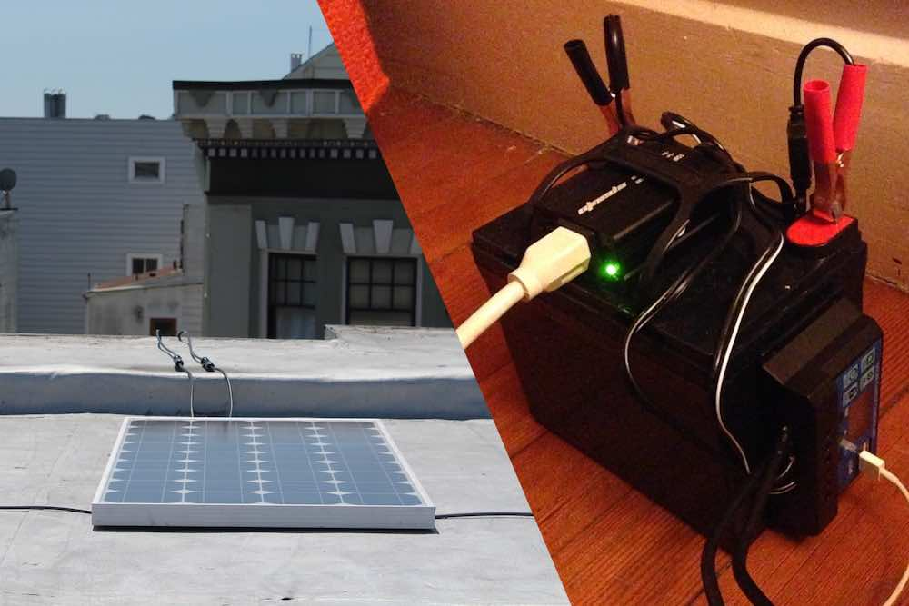

    

        <h6>YEAR</h6>
        <h1><b>[2016]</b></h1>
        

    

    

        <h3 style="color: darkblue">Struggle</h3>
        Niko was renting a San Francisco apartment and ran into a problem installing solar: He could not put panels on his roof because he needed approval from his landlord. Additionally, he would need to remove the rooftop solar and undo the electrical work next time he moved. 
    

    

        
    

    

        <h6>YEAR</h6>
        <h1><b>[2017]</b></h1>
        

    

    

        <h3 style="color: darkblue">Solution</h3>
        Niko needed a self-contained, removable and self-installable solar system. He built a system with parts from Amazon, wrote about it, and received 200,000 reads in a few days and great feedback on this article.
    

    

        
    

    

        <h6>YEAR</h6>
        <h1><b>[2020]</b></h1>
    

    

        <h3 style="color: darkblue">Sunboxlabs Kits Launched</h3>
        Three years and many articles and kits later, we started offering easy kits for purchase. They have been used for camping, RVs, van-life, festivals, backup power after extreme weather and of course in urban apartments.
    

    

        
    

---
<h1 style="text-align: center">Our Vision</h1>

  

  <h3>If we can make <b>solar energy</b> a <b>consumer electronic</b>, it can spread as fast as the satellite dish has.</h3>
  
Or the window air conditioner. Or the smartphone</b>. We are starting small with small kits, but as battery and solar prices come down, we will soon be able to cover more use cases.

  

  

    
    <small style="text-align: center; width: 100%">(Photo: Paweł Czerwiński, Chromatograph)</small>
  

---

<h1 style="text-align: center">Our Mission</h1>

Our mission is to **make purchasing solar/storage as easy as purchasing any other consumer electronic**. 

If we look to the car, the smartphone, the window A/C unit — these devices spread like wildfire across the globe because they were off-the-shelf products that required no configuration but great benefits. Identical appliances were churned out at an industrial scale for a global audience. They were “plug n play”. Plug n play solar has been around for a while, but has never taken off (probably because behind-the-meter power is still sketchy and poorly understood). The potential for plug n play solar is huge — it could mean cheap, zero-configuration solar energy spreading to consumers at the pace of the smartphone, the car or air-conditioning.

----
        

    <h2>As seen on</h2>
    

     

            
        

        

            
        

        

            
        

        

            
        

        

            
        

         

            
        

        

            
        

        

            
        

        

            
        

        <!-- 

            
        
 -->
    

Niko showing off his current system:

<iframe width="100%" height="315" src="https://www.youtube.com/embed/XOsCX6yUe44" frameborder="0" allow="accelerometer; autoplay; clipboard-write; encrypted-media; gyroscope; picture-in-picture" allowfullscreen></iframe>

