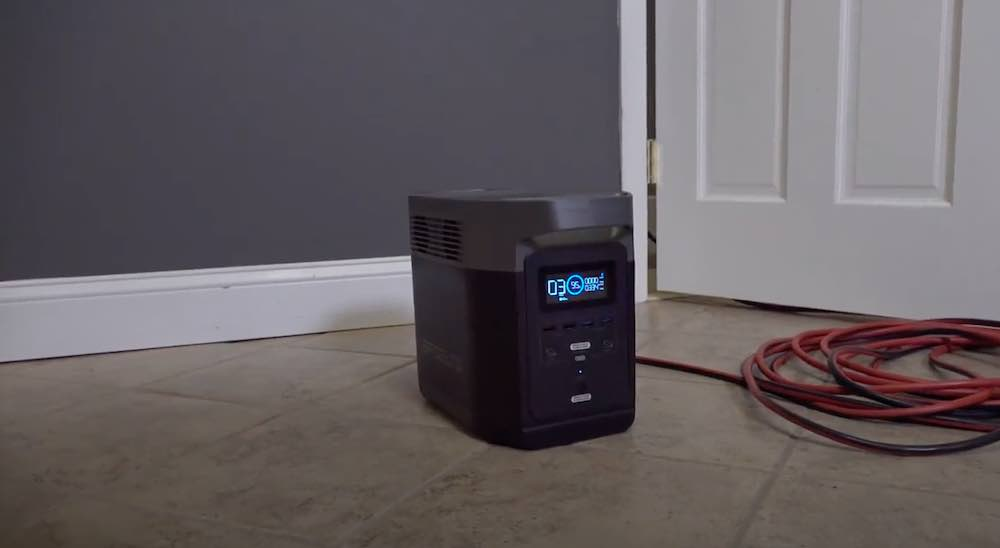

<iframe width="100%" height="315" src="https://www.youtube.com/embed/YyMonPCxzog" frameborder="0" allow="accelerometer; autoplay; encrypted-media; gyroscope; picture-in-picture" allowfullscreen></iframe>

Originally started as a kickstarter campaign, this consistently ranks as one of the most-sold powerful generators out there.

The excellent video review linked below covers the Ecoflow delta, and impressively even gets plugged into the central switch board of a home to run the whole home on backup. It literally runs everything in the house. But first, the product.

  
     
  <a onclick="ga('send', 'event', 'Amazon Affiliate', 'clicked', 'Ecoflow')" class="btn btn-primary btn-lg" target="_blank" style="background-color: orange; border: none" href="https://www.amazon.com/EF-ECOFLOW-Portable-Station-Generator/dp/B083FR3762/ref=as_li_ss_tl?ie=UTF8&linkCode=ll1&tag=gridlesskits-20&linkId=bd36c1062c96e0d43a82dba2f347266f&language=en_US" >Check latest price on Amazon</a>

As demonstrated below, it is very powerful, and it can definitely run anything in your household (add too much AC though, and it'll fade out). Definitely a fridge for keeping your meat cool if the power runs out, and other use cases.

The Ecoflow Delta features a sleek and luxurious design that packs a lot of power. It has a large invertor load, which can handle high-powered appliances under 1800W.

The backup generator has three rechargeable modes: with the lithium battery, solar panel or AC wall adapter. It doesn’t matter where you are, you never have to worry about running out of juice. 

The best part about the Ecoflow Delta is it charges to its full capacity in just 2 hours. This is due to the patented X-Stream Technology that allows the Delta to recharge at 10x the speed of regular generators.

### Pros

* Fast recharge time
* Large invertor load
* Triple recharge methods
* High performance
* 24-month warranty
* Sleek design

### Why We Like It

We like the Ecoflow Delta because it knocks it out of the park with the short recharge time.

This could come in very handy during:
* Backup
* Power Outages
* Hurricane Season
* Wildfire Shutoffs
* Earthquake kits
* Blizzard backup
* Camping
* Boats
* Back Yard Solar
* RVs
* Off-Grid Energy
* Festivals

Thanks for reading, and feel free to reach out if you have any comments. We are considering adding something this powerful to our [line-up](/), so let us know if you would be interested.