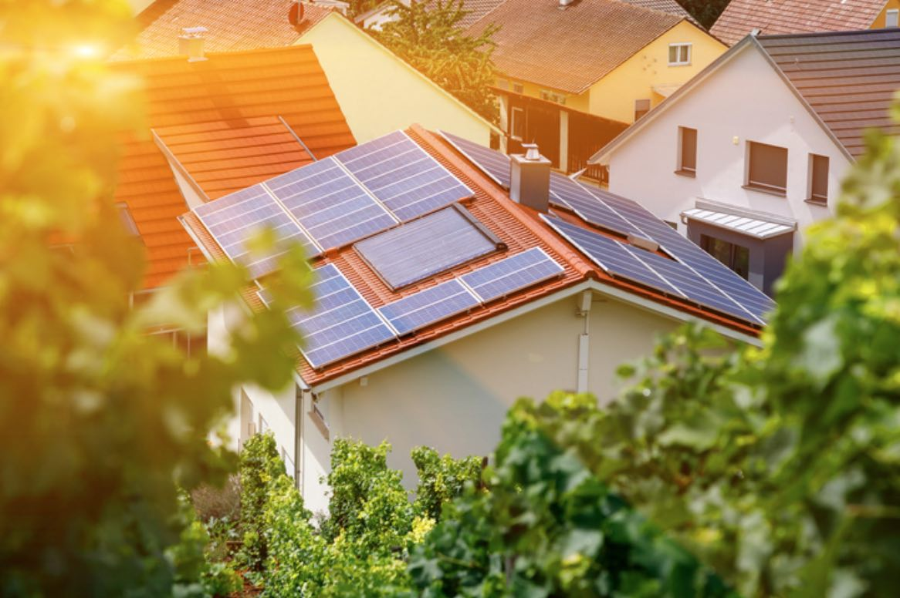

Looking for a better way to power your house? Go solar. Rooftop solar panels convert sunlight into electricity for your home, eliminating or drastically reducing your monthly electric bill. Solar panels are not the right fit for everyone, but for many they&#39;re a great green way to reduce your carbon footprint.

Solar panels are an investment, but you can recoup the initial cost – and more – in the years to come.

Going off the energy grid is becoming an increasingly popular option, with about 600,000 U.S. homeowners enjoying solar panel energy, according to the Solar Energy Industries Association (SEIA), and many more solar systems operating world-wide.

You can feel good about helping this planet move toward sustainable energy sources. Nonrenewable energy-produced electricity sources pollute the earth, but solar energy ensures clean, renewable energy.

Because solar panels have become more popular and technologically advanced, the manufacturing price has dropped, so it&#39;s not just for wealthy homeowners anymore.

Is solar energy the right choice for you? Consider things like your home&#39;s location, how long you&#39;ll remain in your home, whether you want to own or lease your panels, your present electric bill, and financial incentives that may be available.

# What are Solar Panels and How Do They Work?

Solar panels are made from tempered glass. They&#39;re installed on a rack system on your roof and an inverter system generates [electricity for your home](https://porch.com/home-projects/electrical), potentially eliminating dependence on your local electricity company. Your system may include a bi-directional meter that measures the power produced and the amount you use. You may be able to sell any excess power if your local electric company participates.

The system&#39;s monitoring system lets you see the amount of energy your panels produce daily (and over time) and also notifies you if there&#39;s a problem with a panel.

# Pros of Solar Panels

There are a plethora of reasons to go solar, including reducing your carbon footprint and saving money. Many countries rely on fossil-fuel-produced energy, including coal and fuel. Producing electricity from those fuels is expensive. So is the cost of building new nuclear-powered plants. Those increasing costs are passed on to you.

Solar Saves Money

If you dread paying your massive [monthly electricity bill](https://porch.com/advice/save-30000-life-home), solar is definitely an option. Solar could drastically reduce your dependency on your present electric supplier. Installing a solar-powered electric system now could mean your future electric bills could shrink, especially once you&#39;re no longer paying for the cost of the panel system.

You may even be able to make some money from your solar panels. Check with your government and your electric company to see if they have a buy-back energy metering program and solar renewable energy credits. These kinds of programs let you bank money (or receive credit on your electric bill) while your system generates electricity. You could be paid for extra electricity your panels produce.

Low Maintenance Costs

Solar rooftop panels require little maintenance, especially if they&#39;re tilted. They may need a light cleaning every few months to remove dirt, leaves and other debris using a leaf blower or garden hose, and you may also need to clear panels after a heavy snowfall. Panels installed on the ground are even easier to keep clean because they&#39;re on your level.

Solar panels are sturdy so they can weather storms and even hail, but you&#39;ll still want to have a warranty or homeowner&#39;s insurance in case you need to repair or replace any storm-damaged panels.

Reduce your Carbon Footprint

Solar energy is clean and renewable, the perfect way to reduce the atmosphere-damaging carbon dioxide emissions coming from your property. Producing solar electricity doesn&#39;t create pollutants and is even more earth-friendly than nuclear energy.

Your choice to transition your home to solar energy also helps lessen the need for – and the dependency on – fossil fuels.

# Solar Considerations

There are some things to consider before you jump on the solar bandwagon. For instance, how long do you plan to stay in your home? How long will the panels last, and how much should you budget for buying or leasing?

Solar energy isn&#39;t a get-reimbursed-quickly system. Instead, it&#39;s a [long-term investment](https://blog.hireahelper.com/the-5-diy-projects-that-will-boost-your-homes-curb-appeal-and-resale-value/) so consider how long you&#39;ll live in your home. It could take seven or more years for you to recoup the purchase cost through energy savings.

Another thing to consider is the condition of your present roof. You&#39;ll have to remove the panels and put them back when you replace shingles on your roof. Therefore, if you&#39;re considering getting panels, take a good look at your roof. If it has seen better days, you may want to replace it before you install solar panels.

How Long do Panels Last?

Panels are made to give you years of dependable electric service and can last from 25 to 35 years. You can enjoy energy-saving benefits for quite a while before you need to replace them.

Installation costs

Look for a professional company to install your panels. The cost of both panels and installation vary according to your system, region and the location of the panels (on a roof or on the ground).

Can Your Roof Hold Solar Panels?

Before signing up, do some homework on your own roof&#39;s age and materials. Installing solar panels consists of mounting a connected racking system directly onto your roof, and not all roofs are suitable. Roofs on homes that are historical (or are older), those with slate or cedar tile roofs, or homes with skylights or roof decks are difficult to fit with racking systems. There could also be concerns with roof leaks because the racking is screwed directly onto your roof.

If your roof isn&#39;t a candidate for panels but you have the room in your yard, you can have panels installed on the ground. If neither of those locations is an option, you can research whether there&#39;s a local community &quot;solar garden&quot; that you can participate in.

Climate and Weather

The amount of sun that hits your roof and its orientation to the sun can impact how much energy your solar panel system generates each day. The more sun (and less shade) your roof has, the more energy those panels can produce. This is great news for homeowners in high-sun regions.

Solar panels can lose a small amount of their efficiency in climates whose heat rises above about 90 degrees, though. You can keep track of how weather affects your panels through the monitoring panel.

Don&#39;t Forget Insurance

Installing solar panels on your roof may increase – or decrease – the cost of your homeowner&#39;s insurance. This is something to discuss with your insurance company before you have panels secured onto your roof.

# Cost of Solar Panels

The cost of installing solar panels will depend upon the location, the number of panels, the size of the system and other factors. Remember that the more electricity you normally use, the sooner you can recoup your investment by going solar. If you know your current energy usage, you can calculate how much you&#39;ll need to budget monthly for solar panels.

Leasing vs. Buying

There are a couple of ways to start taking advantage of this earth-friendly &quot;off the grid&quot; energy source: you can buy your solar panel system outright or you can lease it. Both ways have pros and cons.

Why Lease?

Some homeowners choose to lease their solar electric systems. Leasing lets you go solar without the big up-front costs. If you don&#39;t have thousands of dollars for a down payment, you can lease while still helping the environment and lowering your electrical bills some.

Leasing lets you install solar panels and start saving right away. You may have numerous finance options when leasing. For instance, you can pay the leasing company for the equipment and use as much energy as you want, or you can pay the solar company based on monthly kilowatt hours used. Some leasing companies also offer the option of buying the panel system at the end of your lease. Financing and leasing options will vary depending on where you live.

Another advantage to leasing solar panels: you won&#39;t have to fix them if there&#39;s an issue. The company you lease them from should do the maintenance and repairs, depending on the terms of your lease.

Down Sides to Leasing

While there are definite pluses to leasing your solar electric system, there also are some drawbacks to ponder.

Solar leasing contracts can last up to 20 years or longer. Also, you probably won&#39;t get any tax benefits or rebates (if wherever you reside offers those) by leasing versus owning. In addition, you&#39;re locked into having equipment on your roof that belongs to a company, not you.

All in all, you still should save money by leasing while doing your part for the planet.

Advantages of Owning

There are definite advantages to owning your solar panel system rather than leasing. One of the biggest pluses is that many governments or electric companies offer incentives for installing this green energy source.

Owning your own system also means you&#39;re not tied to a years-long contract. You own the panels instead of someone else owning the panels. Also, if you decide to sell your home, having a solar energy system can be a great selling point and increase the home&#39;s value.

Disadvantages of Owning

There are some negatives to buying your own system. The most obvious disadvantage is the up-front investment required. If you buy, it may take some years before you break even, depending on how much your electricity bill is now. If you normally don&#39;t have a hefty bill, it will take longer to recoup your costs. If your normal electricity bills are high it could be less time, depending on the cost of your system.

If you own your solar panels and monitoring system, you&#39;ll be responsible for maintaining and repairing (or replacing) when parts fail or need work.

# Solar is the Future

Installing solar panels is an enticing, Earth-friendly option, but it&#39;s wise to consider all factors before taking the plunge. Solar energy system installation and material costs are decreasing as technology and production methods improve, so it&#39;s becoming an appealing alternative to expensive electricity. It is definitely an investment, but worth adding value to your home as you help make this a greener planet.

This article was originally posted on [Porch.com.](https://porch.com/) on their [advice blog](https://porch.com/advice/embrace-future-install-solar-panels-roof) and is re-posted here with their permission.