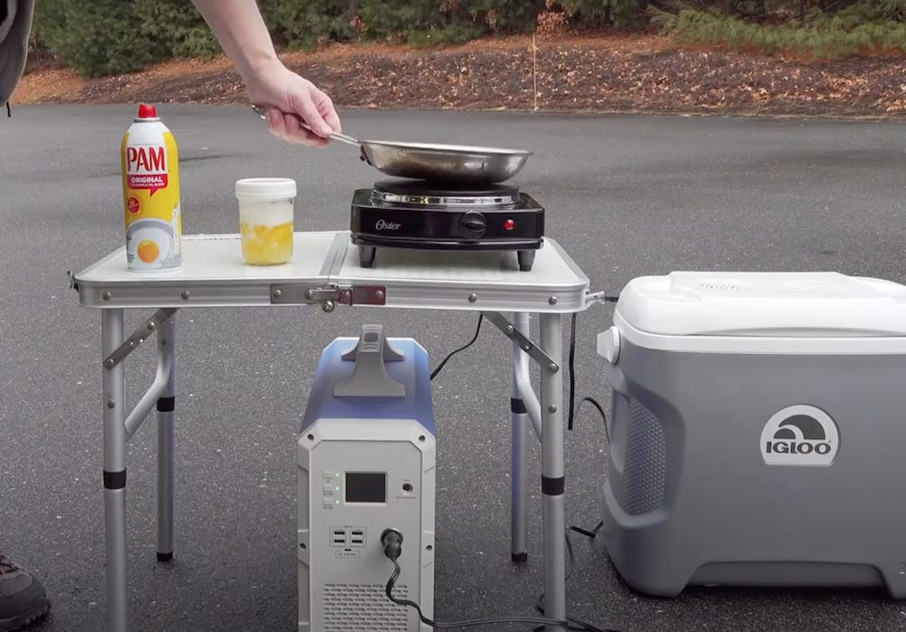

<iframe width="100%" height="315" src="https://www.youtube.com/embed/A9MVTWGvPho" frameborder="0" allow="accelerometer; autoplay; encrypted-media; gyroscope; picture-in-picture" allowfullscreen></iframe>

This is a very powerful portable generator, especially compared to competitors like the Goal Zero Yeti 3000. It is very similar to the 1000W Richsolar model [we sell in our own kits](https://sunboxlabs.com#kits), so we decided to review this model here. To be clear: these are the same generators often from the same factory in China (or another factory using the same moulds). US companies like us, Richsolar, Bluetti etc simply private-label them and deal with shipping, imports, distribution, etc.

As demonstrated in the video below – it's very powerful. It is bordering on being able to run anything in your household (maybe not an inefficient A/C, but everything else). Definitely a fridge.

  
     
  <a onclick="ga('send', 'event', 'Amazon Affiliate', 'clicked', 'Bluetti')" class="btn btn-primary btn-lg" target="_blank" style="background-color: orange; border: none" href="https://www.amazon.com/MAXOAK-Portable-Generator-Emergency-Sinewave/dp/B07QZC1FV3/ref=as_li_ss_tl?ie=UTF8&linkCode=ll1&tag=gridlesskits-20&linkId=c0d6a6d0a2a99e499287d1e29d6f48da&language=en_US" >Check latest price on Amazon</a>

The Maxoak Bluetti is a 1000W generator with a lithium polymer battery cell. It features multiple outputs for a variety of products and can power devices like mini fridges to lights and fans. 

It also offers users the option to charge the Maxoak Bluetti with solar panels, but they are not included in your initial purchase. You can reach a full charge in just 12 hours to power your household items for longer than the average product.

You get everything you need right out of the box for an easy setup and the backup generator also features fancy capabilities such as an LCD display screen and more safeguards.

### Pros

High power
Longer life cycle
Multiple outputs
Can be solar recharged
LCD display screen
Safeguards
Easy setup
Auto shut-off after full charge

### Why We Like It

The Maxoak Bluetti has an auto shut-off function when the device is fully charged to prevent overheating. It is very powerful for the price, and nevertheless portable. We think it is one of the best generators of this size on the market in 2020.

This could come in very handy during:
* Backup
* Power Outages
* Hurricane Season
* Wildfire Shutoffs
* Earthquake kits
* Blizzard backup
* Camping
* Boats
* Back Yard Solar
* RVs
* Off-Grid Energy
* Festivals

-----

Thanks for reading, and feel free to reach out if you have any comments. We are considering adding something this powerful to our [line-up](/), so let us know if you would be interested.