### The Landlord-Friendly, Self-Install Solar + Battery Kit for your off-grid Apartment, Condo, Balcony, Backup and Camping needs

Build an easy DIY mobile solar micro-grid in your apartment, balcony, shared rooftop, garden or RV for easy renewable independence, backup power and the odd outdoor adventure.

Our new off-grid renewable energy micro-grid system is here! We tried to build the best system we possibly could at the lowest possible price. Some benefits include:

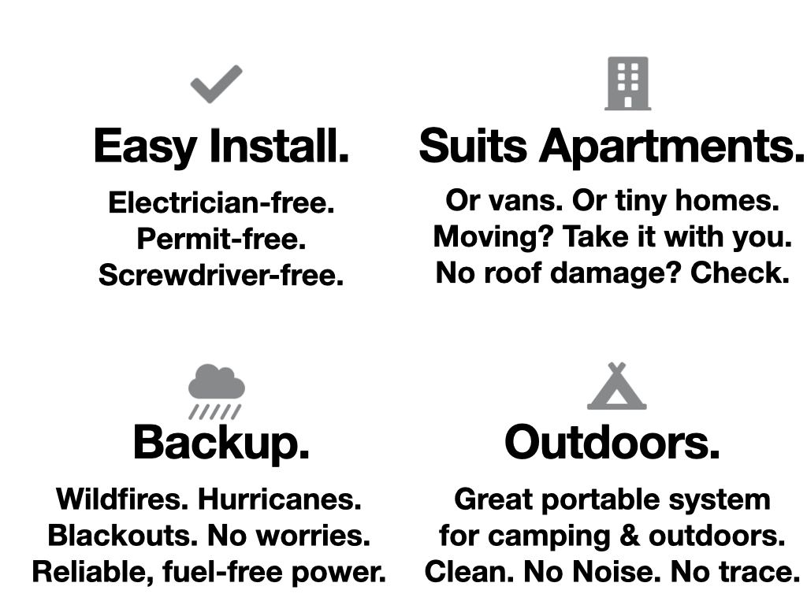
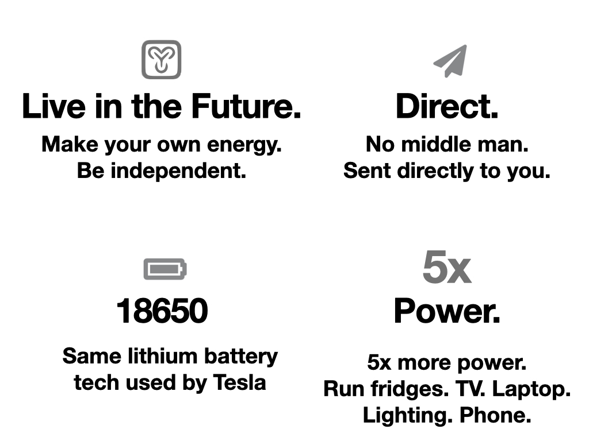

-----

#### What if you could order a solar system online like any other consumer electronic? Now you can!

Due to popular demand, we've decided to offer **mobile apartment solar kits** with **hand-picked** and **tested** components guaranteed to work reliably together, distributed, sold and supported by sunboxlabs. If you'd prefer, you can still order components separately and assemble them yourself. This system is around 5x more powerful than the other ones on the site.

* This is a pre-sale, so we'll only order in bulk when the first 10 orders are in.
* For this initial run, we're taking a very small margin (under $100).
* Additionally, we'll offer every sale a 1-on-1 personal installation session over Zoom with Niko, the founder of Sunboxlabs.

-----
#### The problem

Apartment renters need the landlord’s permission to install anything on their rooftops. This makes installing solar difficult for people who rent. Because most of the world lives in urbanized areas where renting is common, I think this is a problem standing in the way of solar adoption.

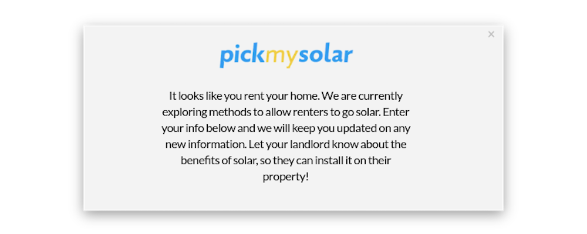

An additional speed bump is the complexity of installing solar: regulation around net-metering. Grid-tied systems. Installation permits (even if you do own your property). Getting quotes from different installers. Solar financing. All complex processes inherited from the construction industry which slow down mass private adoption of renewables.

We attempt to bypass both these problems by building a standalone solar power plant on for windowsill, rooftop or garden with off-the-shelf parts, and discuss the pros and cons of this approach to solar.

-----
####  A possible solution

A windowsill solar system bought we install ourselves solves both problems at once: Renters don’t need permission from their landlords to place things on their windowsill and rooftops if it’s not altering the building, and it’s a one-click, direct purchase with no regulation as long as it’s not tied to the grid (which this one is designed not to be). Two birds with one stone. This makes the solar buying process more like buying a consumer electronic.

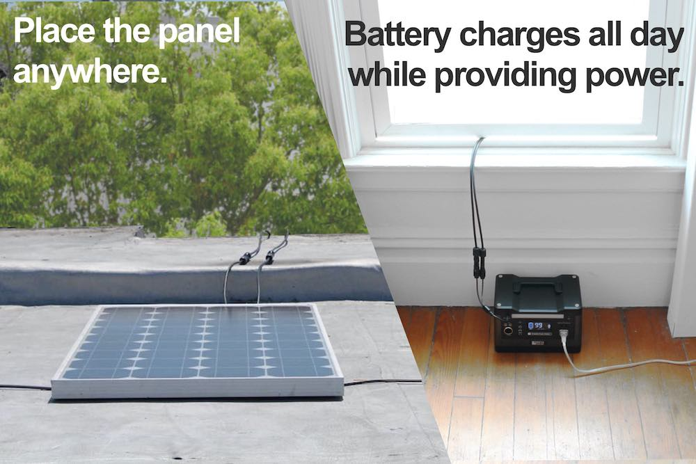

Questions remain. Can this system make any meaningful energy? Does it make financial sense?

-----
#### The System's Components

Pre-order your Mobile Apartment Solar Kits, and you'll receive in 2 boxes by us hand-vetted and tested components:

* **200W flexible solar panels** (2 x 100W) with MC4 connectors. incl. 8 x zip ties to attach to balcony/RV/rooftop/garden structure.
* **20ft solar cable** (2 cables - 1x 20ft positive, 20ft negative) with MC4 connectors on both sides.
* **Indoor Storage Battery** with integrated MPPT solar charge controller, 500Wh of storage, 500W inverter for max output (A/C), 3 USB-A, 1 USB-C, 1 A/C out (220V, 110V, up to 500W). 2 DC outs, 1 DC solar in.
Personalized Zoom session with sunboxlabs founder for installation help.
Money-back guarantee.

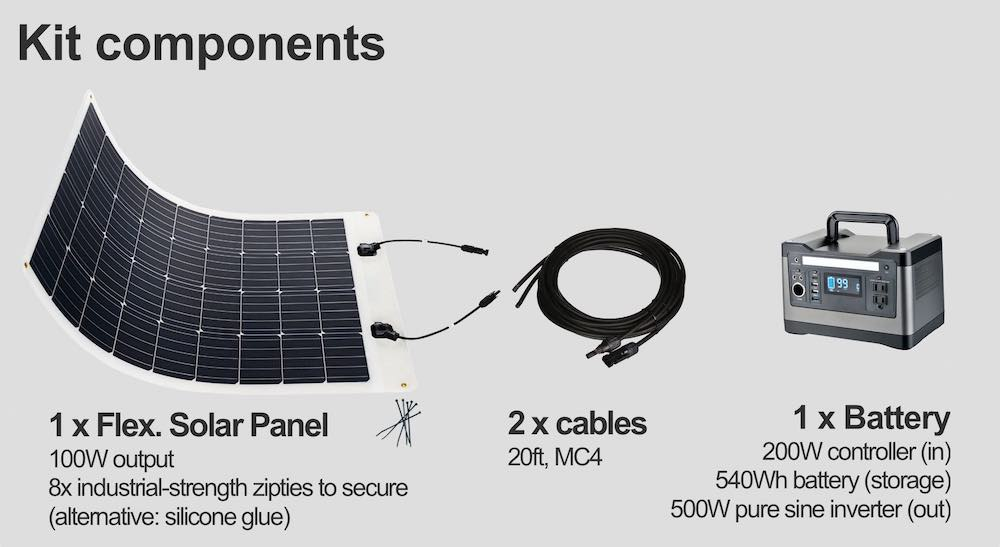

-----
#### Easy Assembly and installation

##### Step 1: Receive packages
The kit should arrive within 30 days of the pre-order phase closing. It'll look like below:

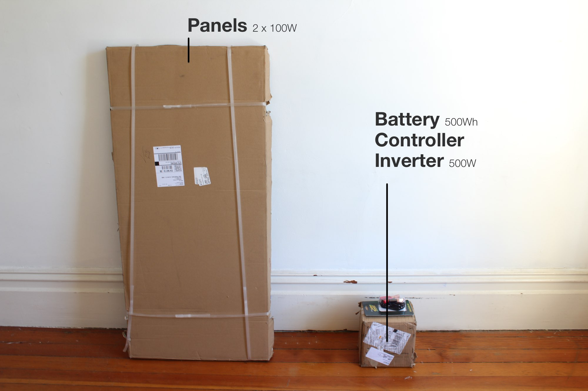

##### Step 2: Zip-tie panels in place

Assembly is simple – zip-tie to the panels anywhere in your garden, on your rooftop, to your balcony, etc. We zip-tie them so that strong winds don't blow them away.

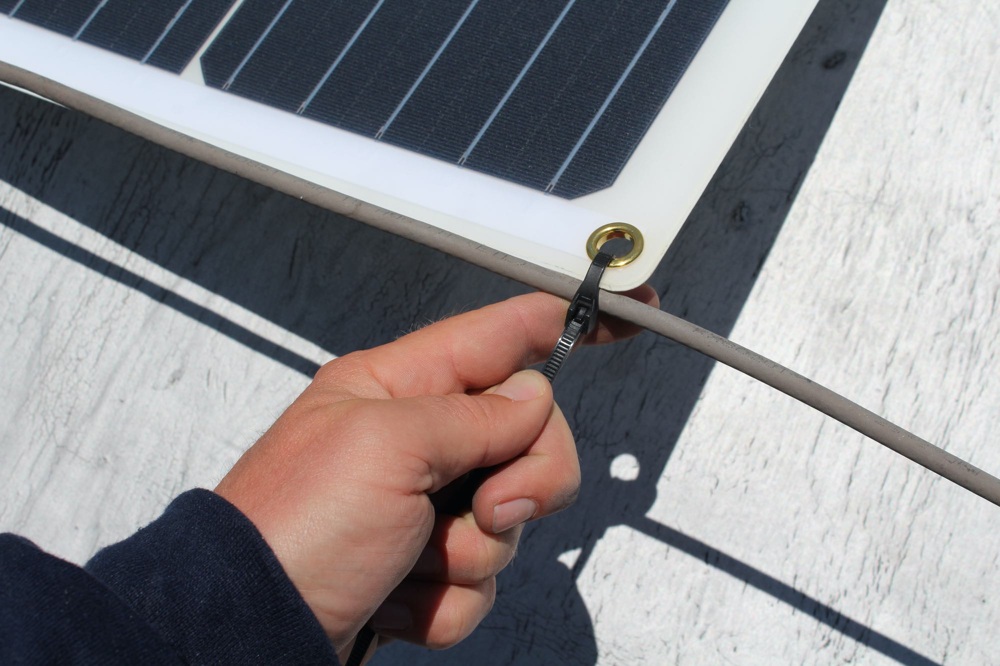

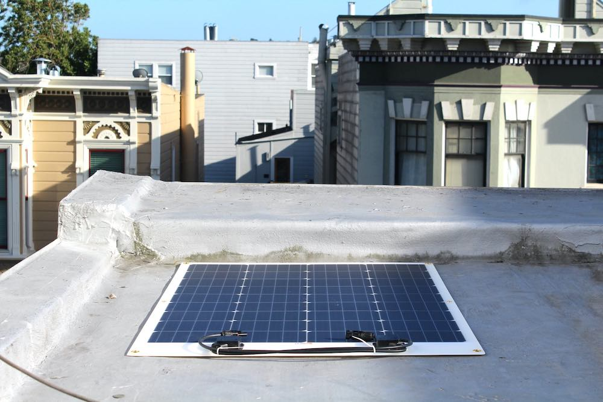

##### Step 3: Run cords to battery indoors

We then pass the cables through to the window inside...

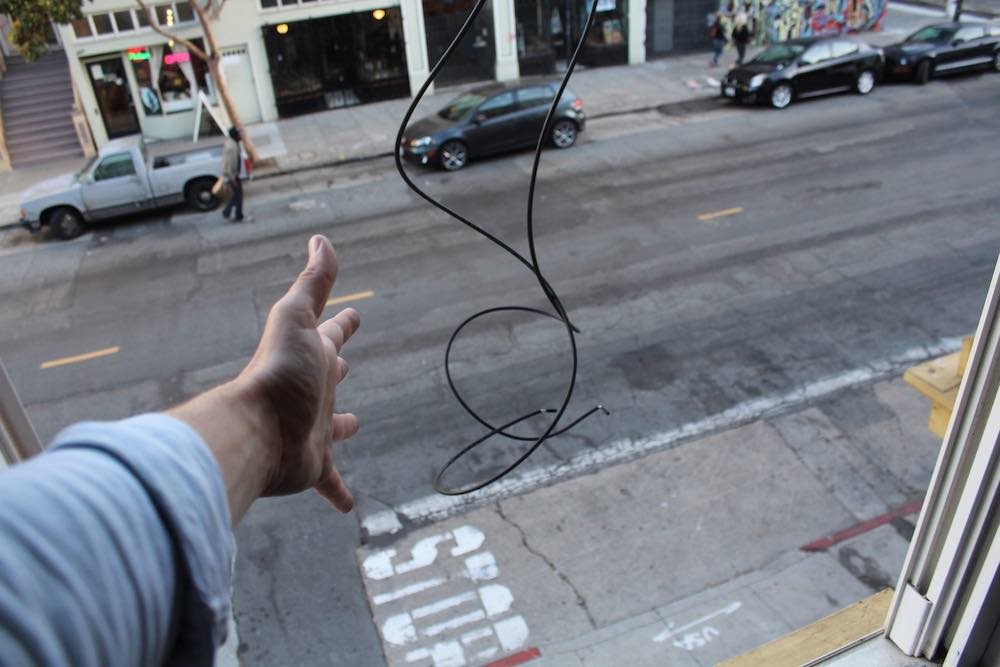

##### Step 4: That's it – start charging. Energy Independence!

... and plug it into the inverter indoors. Close the window on the (thick) wires and you're good to go. We shall be offering a window transmission system soon, too.

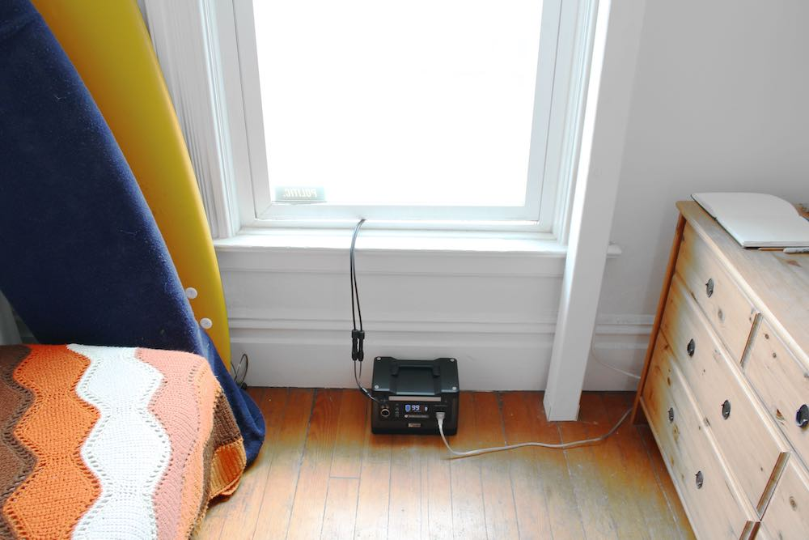

-----

#### Use Cases

These are some of the places we've seen the sunboxlabs testing kits in action.

##### Use case 1: Blackout Resilience & Backup

In case of brownouts or **blackouts**, this is be a helpful way of wirelessly charging communications devices without the grid. This 500W, 500Wh system can even keep full-size, 120W refrigerator running for 4 hours to conserve food, or 10 lights running 24 hours.

During a utility power outage backup for any reason – be it hurricanes or a scheduled wildfire blackout your sunboxlabs system can act as a clean, quiet backup generator. It's not "grid-tied", so you'll have to re-plug your device into the device's socket or move it near the device you want to run. We will offer an option to plug it into your central fuse-box soon, too.

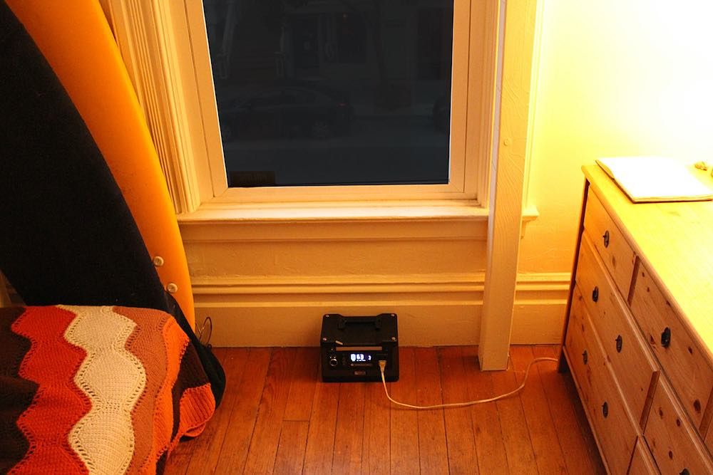

##### Use case 2: Camping, outdoors & off-grid uses.
Be it burning man, music **festivals**, or a weekend getaway – you can run speakers and lights off this system for many hours.

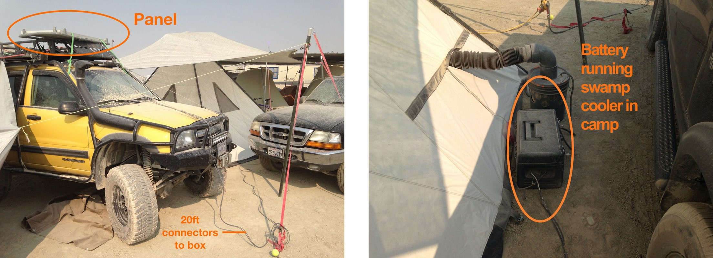

##### Use case 3: A fun start into clean energy.
Make **clean, off-grid power** in your garden or on your apartment rooftop (south-facing, slightly slanted or flat surfaces strongly with some hours of direct sunshine preferred). The cable should be able to run indoors, or you can provide power to your greenhouse, etc.
If our initial run is successful, will offer expansions for you to upgrade to a full household-sized solar system and storage solution to take your home completely off-grid.

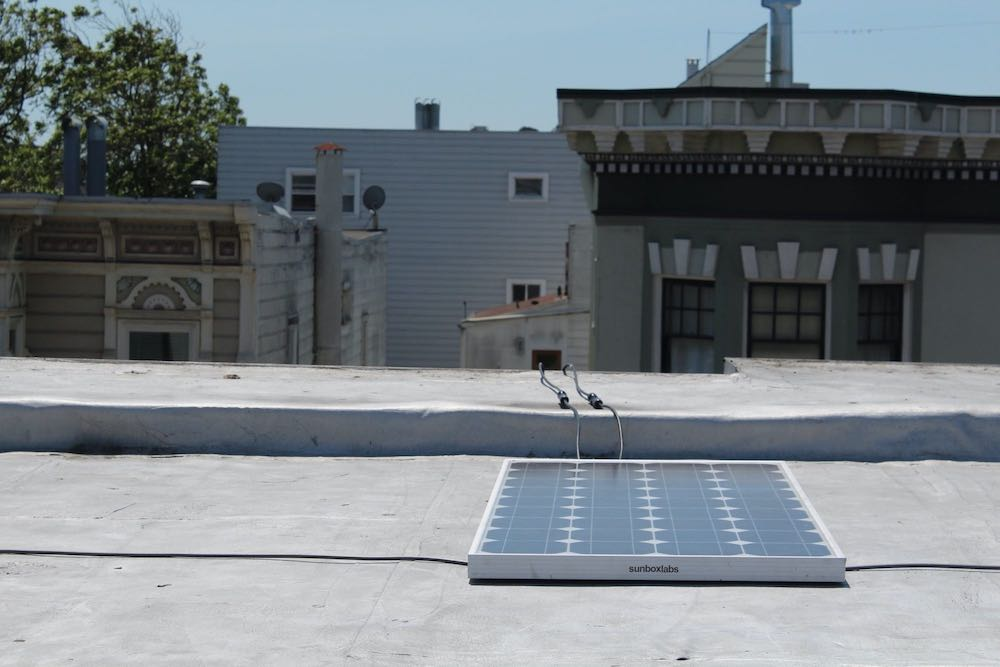

-----
#### Our Mission: Solar access for everyone.

Our mission is to make purchasing solar/storage as easy as purchasing any other consumer electronic, as we believe in a bottom-up theory: once renewable energy does not require a professional it will spread as rapidly as other consumer electronics like window A/C units and satellite dishes, etc.

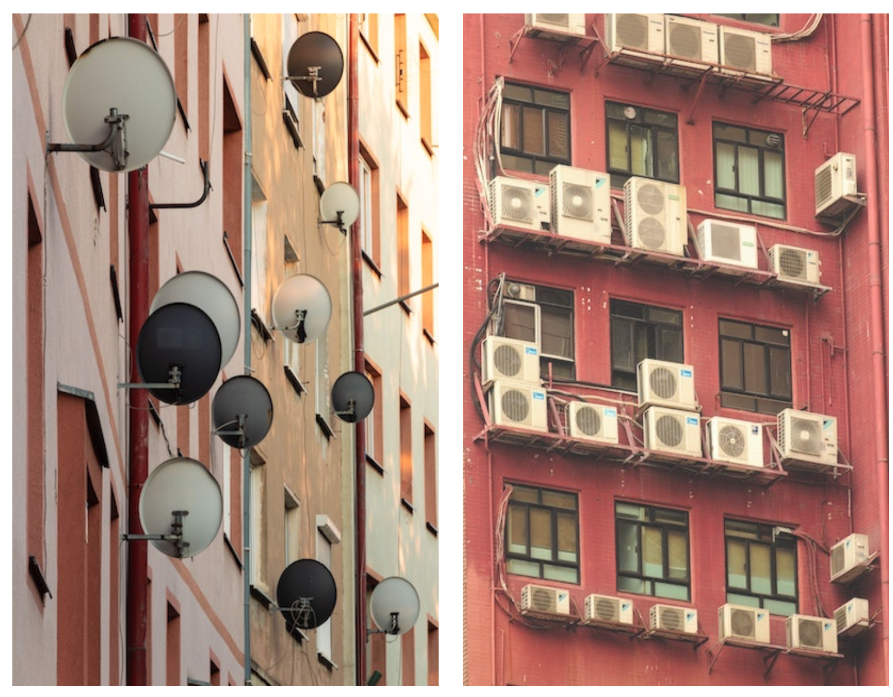

What if autonomous electric generation could be added room by room to a household (like window A/C units)?

If we look to the car, the smartphone, the window A/C unit — these devices spread like wildfire across the globe because they were off-the-shelf products that required no configuration but great benefits. Identical appliances were churned out at an industrial scale for a global audience. They were “plug n play”. Plug n play solar has been around for a while, but has never taken off (probably because behind-the-meter power is still sketchy and poorly understood). The potential for plug n play solar is huge — it could mean cheap, zero-configuration solar energy spreading to consumers at the pace of the smartphone, the car or air-conditioning.

-----
<h4 id="shipping">Shipping & Order Details</h4>

If we do not receive 10 pre-orders before June 25, you will be re-funded in full and we will find another way to get you your system.

Free shipping anywhere in the US. You will receive a follow-up email with exact instructions once we have received enough orders.

Est. arrival time after pre-sale closes: 4 weeks.

Questions or want to say hello? Send to hello@sunboxlabs.com or on WhatsApp +1 (917) 704 3031.

-----
#### Planned future expansions

* Daisy-chain the batteries and solar for a bigger system up to 10kWh / 4kW.
* Grid-tie them to your fuse box to run your household seamlessly during a power outage.
* Window transmission (currently there will be a gap).
* Energy trading between separate households and selling back to the grid (demand response, etc).

-----
<h4 id="faq"> FAQ</h4>

#### 1) How green is it?

Does it have an impact on my CO2 footprint? Let's calculate:

    Production footprint mono-cristalline PV:
    4200kWhee/kW [1] * 0.2kW = 840kWh embodied energy

    Production footprint li-ion 18650 battery:
    321kWhee/kWh [1] * 0.5kWh = 161kWh embodied energy

    Total Footprint: 1001kWh

    Annual energy production system: 310kWh/y

    Payback period: 1001kWh / 310kWh/y = 3.2 year CO2 footprint payback

It'll take 3+ years of usage until this system is CO2 net-positive.

#### 2) Will this system save me a money?

What's the payback period for our solar battery system? Will it save me money?

    Payback period for 200W, 500Wh system
    System cost: $499

    Yearly energy creation: 365d * 4.26hsun/d * 200W = 311kWh/y

    Yearly value creation: 311kWh/y * 15c/kWh = $48/y energy created

    200W system payback period: $500 / $48 = 10 years until payback

Energy prices are just too (unsustainably?) low. This system will not save you money. It will however be more valuable in the event of backup generator needs, at camping/outdoors, and of course it's just generally cool to be independent from the grid.

#### 3) How much electricity will it make?

Short answer It can charge all your laptops and phones and run your speakers and power your lights. It's a powerful solar system with a powerful battery and inverter attached. It cannot run your iron or laundry, but it is enough to back up a full-size, family fridge for a 4 hours a day in summer if the power goes out, or easily power a mini-fridge at the beach for 24 hours. Have fun! :)

Longer answer is in SF it'll make on average 4.26 * 200W = 852Wh (0.85kWh) per day. Of that 500Wh will be stored. Of course in winter it'll make less, in summer more, which is why the solar is a little "over-specced". This means that if you're in a sunnier clime or in summer anywhere, your batteries will always be full even when you're using energy all day from the system.

Any questions? Get in contact above.

#### 4) What're the dimensions? What size and weight is everything?

    Each Solar panel:
    Size: 4 feet x 1 ft 7 inches x 0.1 inches (1230mm x 500mm x 3mm)
    Weight: Roughly 1 lbs

    Connector cables (positive, negative)
    Length: 20 feet each (6.1m)

    Sunbox Battery/Controller/Inverter
    Size: 7.9 inches x 6.9 inches x 6.3 inches (200mm x 176mm x 160mm)
    Weight: Roughly 12 lbs
